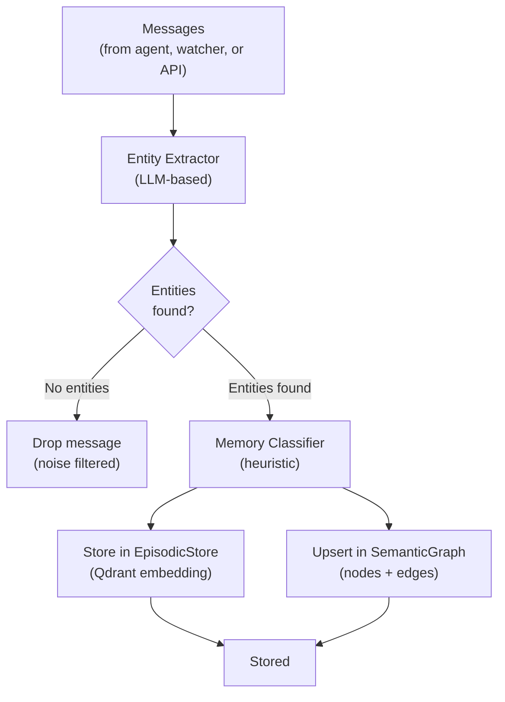
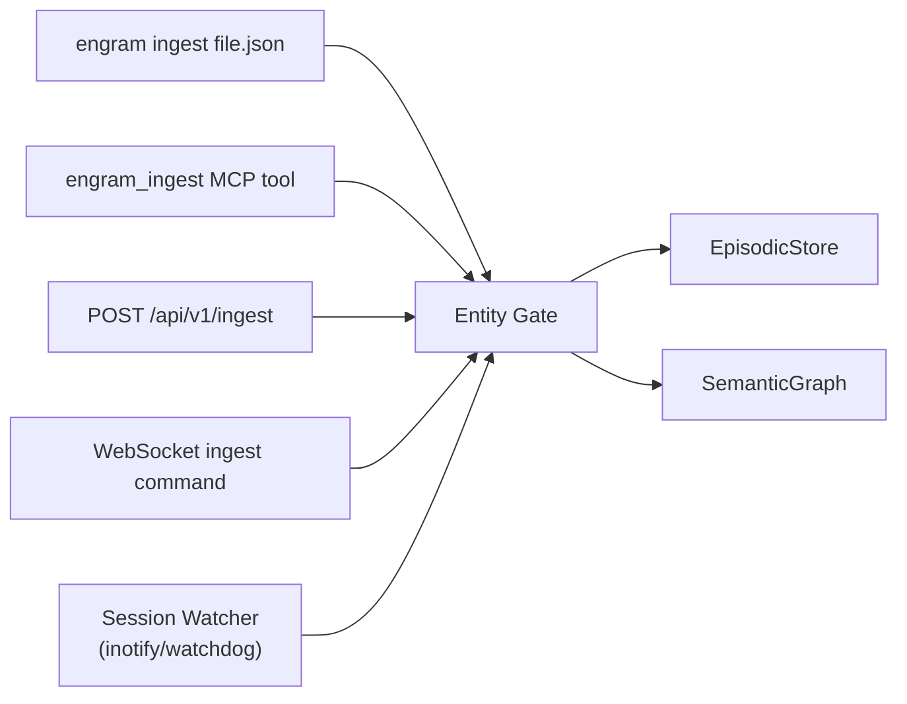

# Entity-Gated Ingestion

Entity-gated ingestion is engram's quality filter for memory storage. Instead of storing every message, engram only persists content that contains meaningful entities — people, projects, technologies, decisions, concepts.

## Why Entity Gating?

Raw AI conversations contain a lot of noise:
- System prompts and instructions
- Filler messages ("ok", "got it", "thanks")
- Ephemeral scaffolding
- Repeated context injections

Storing all of this would pollute recall results with low-quality memories. Entity gating ensures the memory store contains only semantically meaningful content.

## How It Works



## Entity Extraction

The extractor uses an LLM (Gemini) to identify entities from message content:

- **Named entities**: people, organizations, places
- **Technical entities**: technologies, tools, services, frameworks
- **Conceptual entities**: decisions, events, milestones, workflows

Each extraction also identifies relationships between entities, which are used to create edges in the semantic graph.

## Memory Classification

After entities are confirmed, the memory classifier assigns a type using a heuristic regex classifier — no LLM call, no API cost:

| Signals | Type |
|---------|------|
| `decided`, `we will`, `going with` | `decision` |
| `prefer`, `always use`, `don't like` | `preference` |
| `TODO`, `task:`, `action item` | `todo` |
| `error`, `bug`, `exception`, `failed` | `error` |
| `learned`, `lesson`, `note:` | `lesson` |
| `workflow`, `process`, `steps` | `workflow` |
| Default | `fact` |

Supports both English and Vietnamese patterns.

## Dual Storage

Every ingested message is stored in both memory systems simultaneously:

| System | What is stored |
|--------|---------------|
| EpisodicStore (Qdrant) | Full content as vector embedding, with type/priority/tags metadata |
| SemanticGraph (NetworkX + SQLite/PG) | Extracted entities as nodes, relationships as edges |

This dual storage enables both semantic similarity search (episodic) and structured entity queries (semantic) on the same ingested content.

## Ingestion Sources



## Watcher-Based Capture

The session watcher monitors AI agent session files in real time and pipes new messages through the entity gate:

```yaml
capture:
  claude_code:
    enabled: true
    sessions_dir: ~/.claude/projects
  openclaw:
    enabled: true
    sessions_dir: ~/.openclaw/workspace/sessions
```

The watcher captures:
- Text blocks from assistant turns
- Message-sending tool calls (visible side effects)

The watcher skips:
- Thinking/reasoning blocks
- Generic internal tool calls
- Messages shorter than 20 characters

## Poisoning Guard

The entity gate includes a poisoning guard that blocks prompt injection attempts from being stored as memories:

**Blocked patterns:**
- Instruction overrides ("ignore previous instructions")
- Special token injection (`<|system|>`, `[INST]`, etc.)
- Identity manipulation ("you are now a different AI")

Detected injection attempts are logged but not stored.

## Dry Run

Test what would be stored without writing:

```bash
engram ingest conversation.json --dry-run
```

Output shows which messages would pass the entity gate and what type they would be classified as.

## Retrieval Audit

All ingest operations are optionally logged to a JSONL audit file:

```yaml
audit:
  enabled: true
  path: ~/.engram/audit.jsonl
```

Each audit record contains the message hash, extracted entities, classification result, and storage outcome (stored / dropped).
