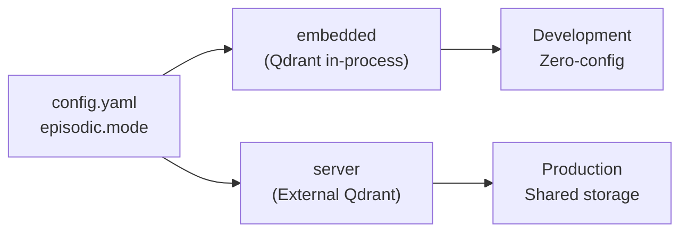
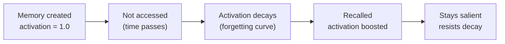

# Episodic Memory

Episodic memory stores timestamped, content-addressed memories as vector embeddings in Qdrant. It answers the question "what happened?" via semantic similarity search.

## Storage Model

Each memory is stored as a Qdrant point:

| Field | Type | Description |
|-------|------|-------------|
| `id` | UUID | Unique memory ID |
| `vector` | float[] | Gemini embedding (1536-dim) |
| `content` | string | Raw memory text |
| `memory_type` | enum | fact, decision, preference, todo, error, context, workflow, meeting_ledger |
| `priority` | int | 1-10 importance score |
| `confidence` | float | 0.0-1.0, adjusted by feedback |
| `tags` | list[str] | Searchable tags |
| `namespace` | string | Tenant namespace |
| `created_at` | datetime | ISO 8601 timestamp |
| `accessed_at` | datetime | Last recall timestamp |
| `access_count` | int | Total recall count |
| `expires_at` | datetime | Optional expiry |
| `topic_key` | string | Optional unique key for upsert |

## Modes



**Embedded mode** (default): Qdrant runs in-process, data stored at `~/.engram/qdrant`. No separate service needed.

**Server mode**: Connects to an external Qdrant instance. Required for multi-process or distributed deployments.

## Ebbinghaus Decay

Engram applies the Ebbinghaus forgetting curve to model memory decay over time. Memories that are accessed frequently maintain high activation scores; memories that are not accessed gradually decay.



The decay scheduler runs daily as a background task. View the current decay state:

```bash
engram decay [--limit 20]
```

## Activation-Based Scoring

Recall results are scored using a composite formula:

```
score = (similarity × 0.6) + (priority × 0.2) + (confidence × 0.1) + (recency × 0.1)
```

Where:
- `similarity` — cosine similarity between query and memory embedding
- `priority` — user-assigned importance (normalized)
- `confidence` — feedback-adjusted confidence score
- `recency` — decay-adjusted temporal score

## Topic-Key Upsert

When a memory is stored with a `topic_key`, it replaces any existing memory with the same key in the same namespace. This prevents unbounded growth for frequently-updated facts:

```bash
engram remember "Current sprint: Sprint 42" --topic-key current-sprint
# Later:
engram remember "Current sprint: Sprint 43" --topic-key current-sprint
# Previous entry is replaced
```

## Feedback Loop

| Event | Effect |
|-------|--------|
| Positive feedback | confidence += 0.15 |
| Negative feedback | confidence -= 0.2 |
| 3x negative + low confidence | auto-delete |

## Embedding Configuration

```yaml
embedding:
  provider: gemini
  model: gemini-embedding-001
  key_strategy: failover      # failover or round-robin
```

**Key rotation**: If `GEMINI_API_KEY_FALLBACK` is set, engram automatically fails over to it when the primary key is rate-limited or unavailable. In `round-robin` mode, keys are rotated on every request.

## Namespace Isolation

Each memory belongs to a namespace (default: `default`). Namespaces provide logical isolation — recall queries only search within the active namespace:

```bash
ENGRAM_NAMESPACE=project-alpha engram remember "Using Go for the API"
ENGRAM_NAMESPACE=project-beta engram remember "Using Rust for the API"

ENGRAM_NAMESPACE=project-alpha engram recall "programming language"
# Returns only project-alpha's memory
```

## Consolidation

When many similar memories accumulate, consolidation reduces redundancy:

```bash
engram consolidate [--limit 50]
```

Process:
1. Cluster memories by Jaccard similarity
2. Send each cluster to LLM for summarization
3. Replace cluster with single consolidated memory
4. Scheduler runs consolidation every 6 hours (configurable)
