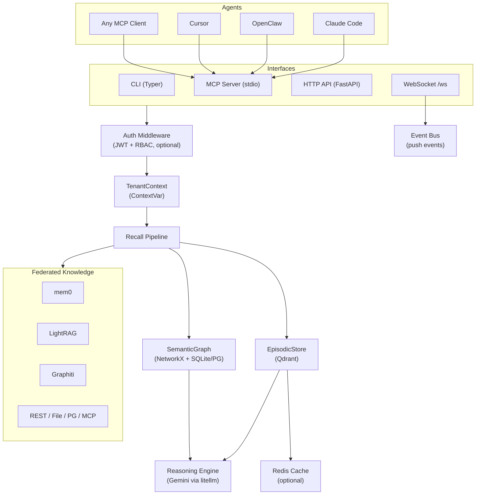
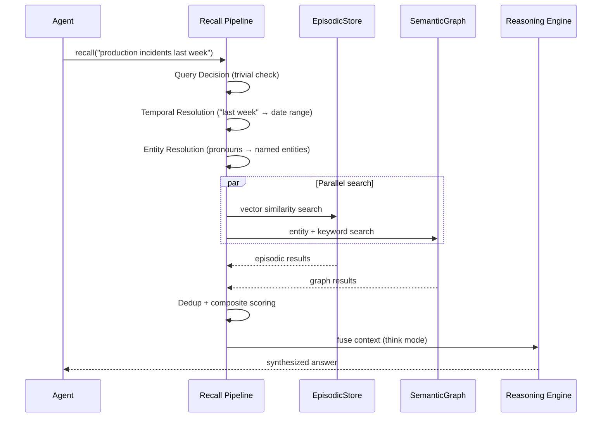
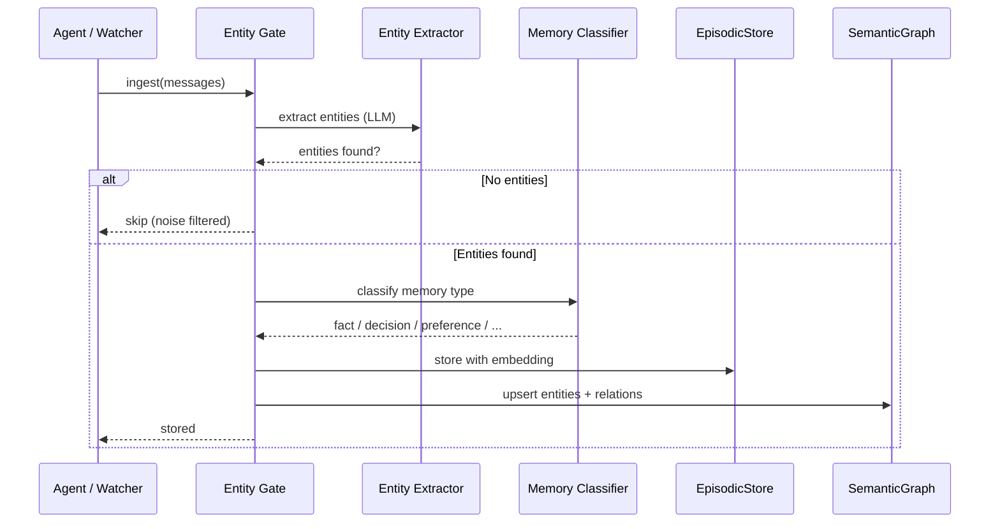

# Architecture

Engram is a dual-memory AI system modeled after how humans store and retrieve information.

## Core Concept

Humans use two complementary memory systems:

- **Episodic memory** — "What happened?" — specific events, timestamped experiences
- **Semantic memory** — "What do I know?" — facts, concepts, relationships

Engram mirrors this with a vector store (episodic) and a knowledge graph (semantic), unified by an LLM reasoning engine.

## System Diagram

## Layers

| Layer | Component | Technology |
|-------|-----------|------------|
| Interface | CLI, MCP, HTTP API, WebSocket | Typer, FastMCP, FastAPI |
| Auth | JWT + API keys, RBAC | python-jose |
| Tenancy | ContextVar propagation | Python contextvars |
| Recall | Pipeline: decide > resolve > search > fuse | Custom |
| Episodic | Vector store | Qdrant (embedded or server) |
| Semantic | Knowledge graph | NetworkX + SQLite/PostgreSQL |
| Reasoning | LLM synthesis | Gemini via litellm |
| Capture | Session watchers | inotify/watchdog |
| Federation | External providers | REST, File, PG, MCP adapters |
| Cache | Result caching | Redis (optional) |
| Observability | Tracing + audit | OpenTelemetry, JSONL |

## Data Flow: Recall

## Data Flow: Ingestion

## Component Deep Dives

- [Episodic Memory](episodic-memory.md) — Qdrant vector store, decay, scoring
- [Semantic Graph](semantic-graph.md) — NetworkX graph, SQLite/PG backend, query DSL
- [Recall Pipeline](recall-pipeline.md) — Full pipeline walkthrough
- [Entity-Gated Ingestion](entity-gated-ingestion.md) — Why and how entities gate storage
