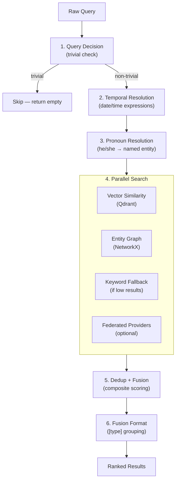
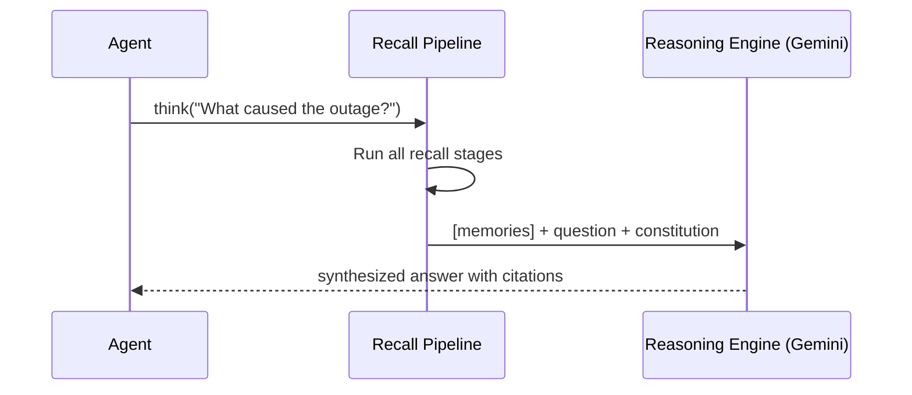

# Recall Pipeline

The recall pipeline is the core query processing system. It transforms a raw query into a fused, ranked set of memories by running through a sequence of specialized stages.

## Pipeline Overview



## Stage 1: Query Decision

Before any search, the pipeline checks if the query is trivial and not worth processing:

**Trivial examples**: `ok`, `thanks`, `yes`, `no`, single emoji, pure punctuation, messages under a length threshold.

Trivial queries return an empty result immediately, saving embedding and LLM API calls.

## Stage 2: Temporal Resolution

Engram resolves temporal expressions in the query before searching, so time-relative queries find the right memories.

**Supported patterns (28 total):**

| Expression | Resolves To |
|-----------|------------|
| `today`, `hom nay` | Current date |
| `yesterday`, `hom qua` | Yesterday's date |
| `last week`, `tuan truoc` | Date range |
| `3 days ago` | Specific date |
| `this month` | Month range |

The resolved dates are embedded into the query and used as Qdrant filter constraints.

## Stage 3: Pronoun Resolution

Pronoun references are resolved to specific named entities using the semantic graph:

| Input | Resolved |
|-------|---------|
| `what did he decide?` | `what did [Alice] decide?` |
| `anh ay lam gi?` | `[Bob] lam gi?` |

Resolution strategy:
1. Look up recent entities in the active session context
2. Search the semantic graph for recently-mentioned entities of matching type
3. Fall back to LLM-based resolution if graph lookup is ambiguous

## Stage 4: Parallel Search

Three search strategies run concurrently:

### Vector Similarity Search

Embeds the resolved query using Gemini and searches Qdrant for nearest neighbors by cosine similarity. Returns the top-K memories above a similarity threshold.

### Entity Graph Search

Looks up entities mentioned in the query by name in the semantic graph, then retrieves episodic memories associated with those entities. Effective for entity-centric queries ("what do we know about Redis?").

### Keyword Fallback

If vector search returns fewer results than a minimum threshold, a keyword search is performed against memory content. This handles cases where the query vocabulary doesn't match the stored embeddings well.

### Federated Providers

When federation is enabled and the query is classified as `domain` (not `internal`), federated providers (mem0, LightRAG, etc.) are queried in parallel and their results merged.

## Stage 5: Dedup + Composite Scoring

Results from all search strategies are deduplicated by content hash, then scored:

```
composite_score = (vector_similarity × 0.6) +
                  (priority_score × 0.2) +
                  (confidence_score × 0.1) +
                  (recency_score × 0.1)
```

Results are sorted by composite score descending.

## Stage 6: Fusion Format

Results are grouped by memory type for structured LLM context injection:

```
[preference] Use PostgreSQL for production databases
[decision] Migrate to microservices in Q2
[fact] Redis is used for session caching
[lesson] Always index foreign keys before running migrations
```

This grouped format helps LLMs distinguish between different kinds of remembered information.

## Think Mode

When `engram think` or `engram_think` is called, the pipeline runs all stages and then passes the fused context to the Reasoning Engine for LLM synthesis:



## Data Constitution

All LLM prompts in the Reasoning Engine are governed by a 3-law constitution:

1. **Namespace isolation** — only reference memories from the active namespace
2. **No fabrication** — answer only from provided context, flag uncertainty explicitly
3. **Audit rights** — all reasoning operations are logged with SHA-256 tamper detection

```bash
engram constitution-status  # Show 3-law text + hash
```

## Resource Tiers

The pipeline degrades gracefully when LLM APIs are unavailable:

| Tier | Behavior |
|------|----------|
| `FULL` | All features: vector search + graph + LLM reasoning |
| `STANDARD` | Vector search + graph, no LLM |
| `BASIC` | Keyword search only |
| `READONLY` | Read-only, no writes |

Tier is checked every 60 seconds and auto-recovers when the API becomes available again:

```bash
engram resource-status
```

## Auto-Memory Detection

The pipeline also includes an ingestion-side auto-memory detector that identifies save-worthy messages without explicit `engram remember` calls:

| Signal | Example |
|--------|---------|
| `Save:` prefix | `Save: use tabs not spaces` |
| Identity statements | `I am the tech lead` |
| Preference statements | `I prefer functional programming` |
| Decision statements | `We decided to use Kafka` |

Detected messages are automatically stored. A poisoning guard blocks prompt injection attempts (instruction overrides, special tokens) from being stored as memories.
