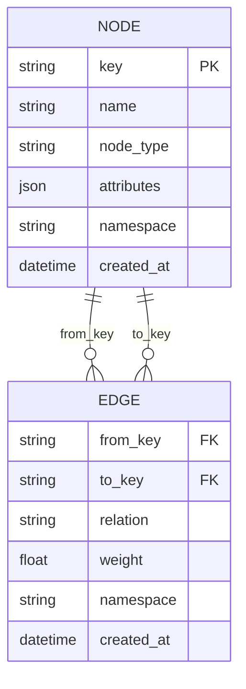
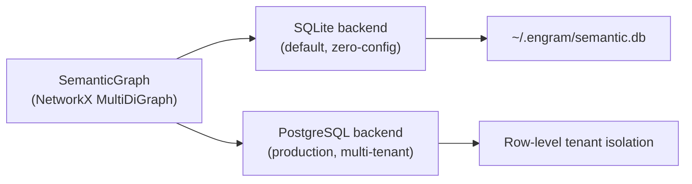

# Semantic Graph

The semantic graph stores named entities and typed relationships as a knowledge graph. It answers "what do I know about X and how does it relate to Y?"

## Data Model



**Nodes** represent entities: people, projects, technologies, decisions, concepts.

**Edges** represent typed relationships: `uses`, `decided`, `depends_on`, `works_on`, `caused`, etc.

## Node Types

Common node types (extensible):

| Type | Example |
|------|---------|
| `Person` | Alice, Bob |
| `Project` | my-app, engram |
| `Technology` | PostgreSQL, Redis, Python |
| `Decision` | Use-microservices |
| `Concept` | caching, auth |
| `Organization` | Anthropic, OpenAI |

## Backends



**SQLite** (default): Zero-config, file-based at `~/.engram/semantic.db`. Suitable for single-user and development.

**PostgreSQL**: Production-grade with row-level security for multi-tenant isolation. Configure via `ENGRAM_SEMANTIC_PROVIDER=postgresql` and `ENGRAM_SEMANTIC_DSN`.

## NetworkX Layer

On top of the persistent backend, engram maintains an in-memory NetworkX `MultiDiGraph` for fast traversal and graph algorithms:

- Degree centrality for entity importance ranking
- BFS/DFS for relationship traversal
- Connected component analysis
- Co-mention detection for auto-linking

## Query DSL

```bash
# Find by keyword
engram query "PostgreSQL"

# Find by type
engram query --type Technology

# Find entities related to a specific entity
engram query --related-to "Alice"

# Combined
engram query "database" --type Technology --format json
```

Via HTTP API:

```bash
curl "http://localhost:8765/api/v1/query?keyword=PostgreSQL&node_type=Technology"
```

## Auto-Link Orphans

Nodes that have no edges can be automatically linked based on co-mentions in episodic memory:

```bash
# Preview what would be linked
engram autolink-orphans --min-co-mentions 3

# Apply the links
engram autolink-orphans --apply --min-co-mentions 3
```

Two entities that appear together in at least N memories are considered co-mentioned and get a `co_mentioned` edge.

## Graph Visualization

```bash
engram graph
```

Opens an interactive vis-network visualization in the browser:

- Dark theme
- Click a node to inspect its attributes and connections
- Search/filter by name or type
- Drag to rearrange layout

The graph data is also available as JSON:

```bash
curl http://localhost:8765/api/v1/graph/data
```

## Entity Extraction

Entities are extracted from memories during ingestion using an LLM-based extractor. The extractor identifies:

- Named entities (people, places, organizations)
- Technical entities (technologies, products, services)
- Temporal entities (events, milestones)
- Relationship types between entities

This extraction drives the entity gate — only messages with extractable entities are stored. See [Entity-Gated Ingestion](entity-gated-ingestion.md).

## Weighted Edges

Edge weights reflect relationship strength. Weights increase when the same relationship is re-asserted across multiple memories, and decrease when conflicting information is stored. This allows the graph to represent confidence in relationships.

## CLI Operations

```bash
# Add entities and relationships manually
engram add node "Redis" --type Technology
engram add node "my-app" --type Project
engram add edge "my-app" "Redis" --relation uses

# Remove
engram remove node "Redis"

# Query
engram query --related-to "my-app" --format table
```
