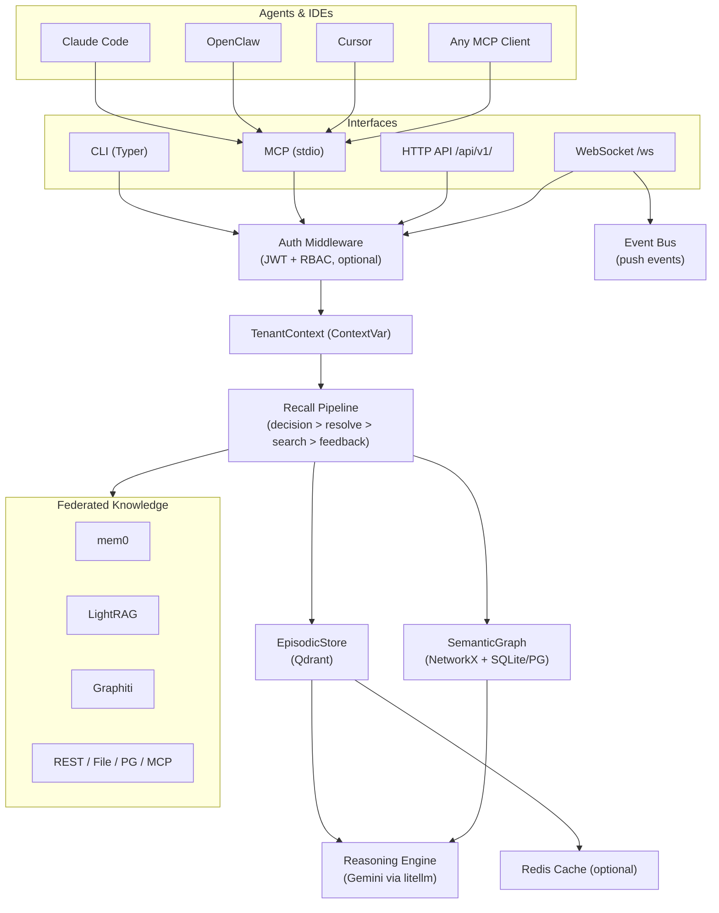

# engram

**Memory traces for AI agents — Think like humans.**

[](https://pypi.org/project/engram-mem/)


Dual-memory AI system combining **episodic (vector)** + **semantic (graph)** memory with LLM reasoning. Entity-gated ingestion ensures only meaningful data is stored. Enterprise-ready with multi-tenancy, auth, caching, observability, and Docker deployment.

Works with **any AI agent or IDE** — Claude Code, OpenClaw, Cursor, and any MCP-compatible client. Federates with external knowledge systems (mem0, LightRAG, Graphiti) via auto-discovery. Exposes **CLI**, **MCP** (stdio), **HTTP API** (`/api/v1/`), and **WebSocket** (`/ws`) interfaces.

```bash
pip install engram-mem
```

---

## Architecture



---

## Features

### Core Memory

- **Episodic Memory** — Qdrant vector store (embedded or server), semantic similarity search, Ebbinghaus decay, activation-based scoring, topic-key upsert
- **Semantic Graph** — NetworkX MultiDiGraph, typed entities and relationships, SQLite (default) or PostgreSQL backend, weighted edges
- **Reasoning Engine** — LLM synthesis (Gemini via litellm), dual-memory context fusion, constitution-guarded prompts
- **Recall Pipeline** — Query decision, temporal+pronoun entity resolution, parallel multi-source search, dedup, composite scoring
- **Entity-Gated Ingestion** — Only stores messages with extracted entities; skips noise (system prompts, trivial messages)
- **Auto Memory** — Detect and persist save-worthy messages automatically, poisoning guard for injection prevention
- **Meeting Ledger** — Structured meeting records with decisions, action items, attendees, topics
- **Feedback Loop** — Confidence scoring (+0.15/-0.2), importance adjustment, auto-delete on 3x negative feedback
- **Graph Visualization** — Interactive entity relationship explorer with dark theme, search, click-to-inspect

### Intelligence Layer

- **Temporal Resolution** — 28 Vietnamese+English date patterns resolve "hom nay/yesterday" to ISO dates before storing
- **Pronoun Resolution** — Resolves "he/she/anh ay" to named entities from graph context, LLM-based fallback
- **Fusion Formatter** — Groups recall results by type `[preference]`/`[fact]`/`[lesson]` for structured LLM context
- **Memory Consolidation** — Jaccard clustering + LLM summarization reduces redundancy

### Multi-Agent & Federated Knowledge

- **Agent Support** — Claude Code, OpenClaw, Cursor, any MCP-compatible agent or IDE
- **Session Capture** — Real-time JSONL session watchers for OpenClaw + Claude Code (inotify/watchdog)
- **Federated Search** — Query mem0, LightRAG, Graphiti, custom REST/File/Postgres/MCP providers in parallel
- **Auto-Discovery** — Scans local ports, file paths, and MCP configs to find providers

### Enterprise

- **Multi-Tenancy** — Isolated per-tenant stores, contextvar propagation, row-level PostgreSQL isolation
- **Authentication** — JWT + API keys with RBAC (ADMIN, AGENT, READER), optional, disabled by default
- **Caching** — Redis-backed result caching with per-endpoint TTLs
- **Rate Limiting** — Sliding-window per-tenant limits
- **Audit Trail** — Structured before/after JSONL log for every episodic mutation
- **Resource Tiers** — 4-tier LLM degradation (FULL > STANDARD > BASIC > READONLY), 60s auto-recovery
- **Data Constitution** — 3-law LLM governance (namespace isolation, no fabrication, audit rights), SHA-256 tamper detection
- **Observability** — OpenTelemetry + JSONL audit logging
- **Deployment** — Docker Compose, Kubernetes-ready, health checks
- **Backup/Restore** — Memory snapshots, point-in-time recovery

---

## Quick Install

```bash
# From PyPI
pip install engram-mem

# Initialize config
engram init

# Set your API key
export GEMINI_API_KEY="your-key"

# Start the daemon
engram start

# Store a memory
engram remember "Deployed v2.1 to production at 14:00 - caused 503 spike"

# Search memories
engram recall "production incidents"
```

**Requirements:** Python 3.11+, `GEMINI_API_KEY` for LLM reasoning and embeddings.

---

## Interfaces

| Interface | How to Access | Use Case |
|-----------|--------------|----------|
| **CLI** | `engram <command>` | Local scripts, terminal workflows |
| **MCP** | `engram-mcp` (stdio) | Claude Code, Cursor, any MCP client |
| **HTTP API** | `engram serve` → `/api/v1/` | Remote agents, integrations |
| **WebSocket** | `/ws?token=JWT` | Real-time bidirectional push events |

---

## License

MIT — Copyright (c) Do Cao Hieu
