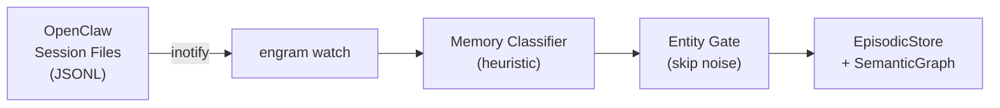

# OpenClaw

Engram has deep integration with OpenClaw — both as an MCP server and via real-time session capture.

## MCP Setup

Install the engram skill in OpenClaw, then add to OpenClaw's MCP configuration:

```json
{
  "mcpServers": {
    "engram": {
      "command": "engram-mcp",
      "env": { "GEMINI_API_KEY": "your-key" }
    }
  }
}
```

## Session Capture

Engram can watch OpenClaw's session files and automatically ingest conversation context into memory. Enable in `~/.engram/config.yaml`:

```yaml
capture:
  openclaw:
    enabled: true
    sessions_dir: ~/.openclaw/workspace/sessions
```

Start the watcher daemon:

```bash
engram watch --daemon
# or as part of the full daemon
engram start
```

The watcher uses inotify/watchdog to monitor JSONL session files in real time. It captures:

- Text blocks from assistant turns
- Message-sending tool calls
- Skips thinking blocks, trivial messages (< 20 chars), and generic tool calls

## How Session Capture Works



Each captured message is classified by type (fact, decision, preference, todo, error, workflow, lesson) using a heuristic regex classifier — no LLM cost at capture time.

## OpenClaw Memory Files as Federation Provider

Engram auto-discovers OpenClaw's workspace memory files as a federated provider:

```yaml
# Auto-discovered via file adapter
# ~/.openclaw/workspace/memory/*.md
```

This means `engram recall` will also search OpenClaw's memory markdown files alongside engram's own stores.

## Per-File Threading

The watcher uses per-file `threading.Lock` to prevent duplicate inotify captures when files are written rapidly.

## Verify

```bash
engram health
engram status
```

Check that the watcher is running and capturing sessions correctly.
